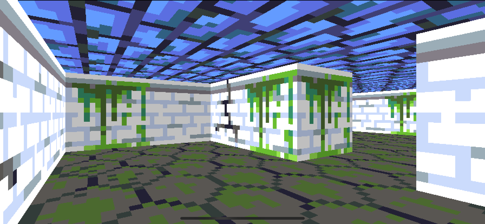

## Retro Rampage

### About

Retro Rampage is a tutorial series in which you will learn how to build a Wolfenstein-like game from scratch, in Swift. Initially the game will be targeting iPhone and iPad, but the engine should work on any platform that can run Swift code.

Modern shooters have moved on a bit from Wolfenstein's grid-based 2.5D world, but we're going to stick with that template for a few reasons:

* It's feasible to build Wolfenstein's 3D engine from scratch, without a lot of complicated math and without needing to know anything about GPUs or shaders.

* It's simple to create and visualize maps that are constructed on a 2D grid, avoiding the complexities of 3D modeling and animation tools.

* Tile grids are an excellent way to prototype techniques such as procedural map generation, pathfinding and line-of-sight calculations, which can then be applied to more complex worlds.

### Background

Ever since I first played Wolfenstein 3D on a friend's battered old 386 back in 1993 (the Mac version wasn't released until several years later) I was hooked on the *First-Person Shooter*.

As an aspiring programmer, I wanted to recreate what I had seen. But armed only with 7th grade math and a rudimentary knowledge of BASIC, recreating the state-of-the-art in modern PC 3D graphics was hopelessly beyond my reach.

More than two decades later, a few things have changed:

* Apple has given us (well, sold us) the iPhone - a mobile computer many hundreds of times more powerful than a DOS-era desktop PC.

* Chris Lattner has given us Swift - a simple, powerful programming language with which to write apps and games.

* John Carmack has given us the Wolfenstein source code, and the wizardry behind it has been thoroughly demystified.

I guess now is as good a time as any to scratch that quarter-century itch and build an FPS!

### Tutorials

The tutorials below are designed to be completed in order, and each step builds on the code from the previous one. If you decide to skip ahead, project snapshots for each step are available [here](https://github.com/nicklockwood/RetroRampage/releases).

The tutorials are written with the assumption that you are already familiar with Xcode and are comfortable setting up an iOS project and adding new files to it. No prior knowledge of the Swift language is assumed, so it's fine if you've only used Objective-C or other C-like languages.

[Part 1 - Separation of Concerns](Tutorial/Part1.md)

Unlike most apps, games are (or should be) highly independent of any given platform. Swift has already been ported to many platforms outside of the Apple ecosystem, including Android, Ubuntu, Windows and even Raspberry Pi. In part one we'll see how to set up our project to minimize dependencies with iOS and provide a solid foundation for writing a fully portable game engine.

[Part 2 - Mazes and Motion](Tutorial/Part2.md)

Wolfenstein 3D - despite the name - is really a 2D game projected into the third dimension. The game mechanics work exactly the same as for a top-down 2D shooter, and to prove that we'll start by building the game from a top-down 2D perspective before we make the shift to first-person 3D.

[Part 3 - Ray Casting](Tutorial/Part3.md)

Long before hardware accelerated 3D graphics, some of the greatest game programmers of our generation were creating incredible 3D worlds armed only with a 16-bit processor. We'll follow in their footsteps and bring our game into the third dimension with an old-school graphics hack called *ray casting*.

[Part 4 - Texture Mapping](Tutorial/Part4.md)

In this chapter we'll spruce up the bare walls and floor with *texture mapping*. Texture mapping is the process of painting or *wall-papering* a 3D object with a 2D image, helping to provide the appearance of intricate detail in an otherwise featureless surface.

More to follow!

### Acknowledgments

I'd like to thank [Nat Brown](https://github.com/natbro) and [PJ Cook](https://github.com/pjcook) for their invaluable feedback on the first draft of these tutorials.

Thanks also to [Lode Vandevenne](https://github.com/lvandeve) and [Fabien Sanglard](https://github.com/fabiensanglard/), whom I've never actually spoken to, but whose brilliant explanations of ray casting and the Wolfenstein engine formed both the basis and inspiration for this tutorial series.

### Further Reading

If you've completed the tutorials and are eager to learn more, here are some resources you might find useful:

* [Lode's Raycasting Tutorial](https://lodev.org/cgtutor/raycasting.html#Introduction) - A great tutorial on ray casting, implemented in C++.
* [Game Engine Black Book: Wolfenstein 3D](https://www.amazon.co.uk/gp/product/1727646703/ref=as_li_tl?ie=UTF8&camp=1634&creative=6738&creativeASIN=1727646703&linkCode=as2&tag=charcoaldesig-21&linkId=aab5d43499c96f7417b7aa0a7b3e587d) - Fabien Sanglard's excellent book about the Wolfenstein 3D game engine.
* [Swiftenstein](https://github.com/nicklockwood/Swiftenstein) - A more complete but less polished implementation of the ideas covered in this tutorial.
* [Handmade Hero](https://handmadehero.org) - A video series in which games industry veteran [Casey Muratori](https://github.com/cmuratori) builds a game from scratch in C.

### Tip Jar

I started this tutorial series thinking it would take just a few days. Nearly two months later, with no end in sight, I realize I may have been a bit naive. If you've found it interesting, please consider donating to my caffeine fund.

